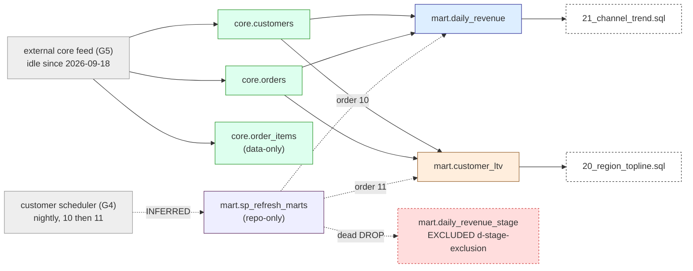

# Order analytics — pipeline analysis

Plan step `pipeline-analysis` (phase Foundation), board UNT2, branch base `migration-run-13`.
Builds on `order_analytics_inventory.md` (PR #51), `03_recon_tolerances.json` (`tol-redshift-orders-v1`,
plan revision 24), `04_target_state.md`, `09_capabilities.json` (`ready: true`), `10_access_requests.md`.
Analysis only: no plan, no converted code. Legacy was read only through `redshift_src` (one
`information_schema.columns` read for the mart column types, §4); `sql/etl/*` was not executed.

Marking: **FACT** = read from the live catalog or the committed inventory; **INFERRED** = derived from
repository SQL or README text with no live confirmation.

## 1. Scope

| | |
|---|---|
| Pipeline | order analytics: core feed → two nightly marts → two reports |
| Source | Redshift Serverless `demo-wg`, database `demo`, schemas `core`, `mart`; read through foreign catalog `redshift_src` only |
| Target | `migration_demo.core.*`, `migration_demo.mart.*` (the only allowlisted catalog); warehouse `565cd2fd713738c4`; identity OAuth M2M SP `d9d1c4ec-…` (`DATABRICKS_HOST` / `DATABRICKS_CLIENT_ID` / `DATABRICKS_CLIENT_SECRET`, never the PAT) |
| Entry feeds | external loader into `core.customers`, `core.orders`, `core.order_items` (loader unknown, inventory G5; `drift_loader.py` drift expected later). Idle since 2026-09-18 16:10 UTC (FACT) |
| Terminal outputs | `sql/reports/20_region_topline.sql` (reads `mart.customer_ltv`), `sql/reports/21_channel_trend.sql` (reads `mart.daily_revenue`), dashboard readers through the `PUBLIC` grant |
| Exclusions | `mart.daily_revenue_stage` — phantom, only ever `DROP`ped by `12_sp_refresh_marts.sql`; decision `d-stage-exclusion`; **no unit** |
| Out of scope | `mig_redshift_src.*` (two procedures on the workgroup, different database), masking/RLS (none exist), scheduler product (G4) |

Unreachable sources reported, not widened: the scheduler definition (G4) and the core loader (G5) are
not Redshift catalog objects and were not probed.

## 2. Unit inventory

Unit ids are the directory names under `.migration/units/`.

| Unit | Wave | Location | Workload | Reads | Writes | Complexity | Shared | Dialect risks |
|---|---|---|---|---|---|---|---|---|
| `core_customers` | 0 | `sql/ddl/02_core_tables.sql`; data via `redshift_src.core.customers` (2,000 rows) | data backfill | feed | `migration_demo.core.customers` | S | yes (read by both marts) | `IDENTITY(1,1)`, `CHAR(12)`/`CHAR(4)` padding, `DISTKEY`/`SORTKEY` removal, `GETDATE()` default |
| `core_orders` | 0 | same DDL; `redshift_src.core.orders` (65,597 rows) | data backfill | feed | `migration_demo.core.orders` | S | yes | `IDENTITY(1,1)` BIGINT, `CHAR(10)` `order_status`, `DECIMAL(12,2)`, `COMPOUND SORTKEY` removal |
| `core_order_items` | 0 | same DDL; `redshift_src.core.order_items` (151,803 rows) | data backfill, **data-only** | feed | `migration_demo.core.order_items` | S | no (no reader in scope) | `IDENTITY(1,1)`, `CHAR(16)` `sku`, `SMALLINT`, `DECIMAL(5,4)` |
| `mart_daily_revenue` | 1 (pilot) | `sql/etl/10_build_daily_revenue.sql` + consumer `sql/reports/21_channel_trend.sql` | nightly CTAS → `CREATE OR REPLACE TABLE`; report | `core.orders`, `core.customers` | `migration_demo.mart.daily_revenue` (2,997 rows) | M | no | `TRUNC(ts)`, `DECODE`, padded `'CANCELLED  '`, `GETDATE()` cutoff, `COUNT(DISTINCT)`, division scale, `DISTSTYLE ALL`; report: `DATEADD(day,-30,…)` |
| `mart_customer_ltv` | 2 | `sql/etl/11_build_customer_ltv.sql` + consumer `sql/reports/20_region_topline.sql` | nightly CTAS → `CREATE OR REPLACE TABLE`; report | `core.customers`, `core.orders` | `migration_demo.mart.customer_ltv` (2,000 rows) | M | no | `DATEDIFF(day,…)`, `AVG(DECIMAL)` scale, padded compare, `DISTKEY`/`SORTKEY` |
| `nightly_refresh` | 3 | `sql/etl/12_sp_refresh_marts.sql` (plpgsql, **repo-only**, hand-converted) + scheduler order 10 → 11 | orchestration → Lakeflow Job (bundle target `migration`, PAUSED) | — | none of its own (§6) | S | — | plpgsql → job shell; dead `DROP` of excluded stage table; `RAISE INFO` → task log |

Consumers are not separate units: each report is a routine row (`writes: []`) inside the unit of the
mart it reads, converted and parity-checked there. Lakebridge `redshift` transpile was not used: the
`databricks labs` CLI reports no projects installed on this box; the static SQL is small enough to
hand-convert from the dictionary below, and `sp_refresh_marts` is hand-converted by rule.

## 3. DAG

Edges `core → mart` and `mart → report` are FACT (SQL text and the inventory's live recompute, which
matched both marts). `scheduler → sp_refresh_marts → 10 → 11` is INFERRED (README comment; zero `CALL`s
in `sys_procedure_call`; the procedure is not deployed). `order_items` has no downstream edge.

## 4. Field/type dictionary

Core types are FACT from `sql/ddl/02_core_tables.sql` (= live catalog per the inventory). Mart types are
FACT from `redshift_src.information_schema.columns` read on 2026-10-02 (CTAS-derived). Target types are the
Delta types declared in each `mapping_spec.json`; the canonicalization rule is the one recon applies
(`harness/examples/canonicalization.redshift.json`).

### 4.1 `migration_demo.core.customers` (key `customer_id`)

| Column | Redshift | Delta | Recon rule | Risk |
|---|---|---|---|---|
| customer_id | INTEGER IDENTITY(1,1) | INT | — | identity continuity (§4.6) |
| customer_code | CHAR(12) NOT NULL | STRING | rstrip_spaces | collation/padding |
| full_name | VARCHAR(120) NOT NULL | STRING | — | |
| email | VARCHAR(160) | STRING | — | `empty_string_is_null` is `SET_AT_STOP_A` in the canon file: not enabled; nulls compared as-is |
| region | CHAR(4) NOT NULL | STRING | rstrip_spaces | padded compare in marts (`GROUP BY c.region` keeps padding on Redshift) |
| signup_date | DATE NOT NULL | DATE | — | |
| is_active | BOOLEAN DEFAULT TRUE | BOOLEAN | — | |
| created_at | TIMESTAMP DEFAULT GETDATE() | TIMESTAMP | datetime_utc_truncate_ms | Redshift TIMESTAMP is zoneless UTC; Delta TIMESTAMP session-zoned → warehouse session TZ must be UTC (nondeterminism) |

### 4.2 `migration_demo.core.orders` (key `order_id`)

| Column | Redshift | Delta | Recon rule | Risk |
|---|---|---|---|---|
| order_id | BIGINT IDENTITY(1,1) | BIGINT | — | identity continuity |
| customer_id | INTEGER NOT NULL | INT | — | FK to customers is undeclared on both sides (inventory: no constraints) |
| order_ts | TIMESTAMP NOT NULL | TIMESTAMP | datetime_utc_truncate_ms | drives `TRUNC(order_ts)`, `MIN/MAX`, `DATEDIFF` |
| order_status | CHAR(10) NOT NULL | STRING | rstrip_spaces | `<> 'CANCELLED  '` must become `rtrim(order_status) <> 'CANCELLED'` (or compare on stored rtrimmed value) |
| order_total | DECIMAL(12,2) NOT NULL | DECIMAL(12,2) | decimal_round | sums widen to NUMERIC(38,2) on Redshift |
| sales_channel | VARCHAR(20) DEFAULT 'web' | STRING | — | `DECODE` input; values other than web/app → RETAIL |
| loaded_at | TIMESTAMP DEFAULT GETDATE() | TIMESTAMP | datetime_utc_truncate_ms | run-date pin column for recon |

### 4.3 `migration_demo.core.order_items` (key `order_item_id`, data-only)

| Column | Redshift | Delta | Recon rule | Risk |
|---|---|---|---|---|
| order_item_id | BIGINT IDENTITY(1,1) | BIGINT | — | identity continuity |
| order_id | BIGINT NOT NULL | BIGINT | — | orphan rows possible (no FK, feed stopped earlier than orders) |
| sku | CHAR(16) NOT NULL | STRING | rstrip_spaces | |
| quantity | SMALLINT NOT NULL | SMALLINT | — | |
| unit_price | DECIMAL(10,2) NOT NULL | DECIMAL(10,2) | decimal_round | |
| discount_pct | DECIMAL(5,4) DEFAULT 0 | DECIMAL(5,4) | decimal_round | scale 4 preserved |

### 4.4 `migration_demo.mart.daily_revenue` (key `order_date, region, channel_group`)

| Column | Redshift (live) | Delta | Legacy expression → Databricks | Recon rule | Risk |
|---|---|---|---|---|---|
| order_date | DATE | DATE | `TRUNC(o.order_ts)` → `CAST(o.order_ts AS DATE)` | — | key; run-date scope column |
| region | CHAR(4) | STRING | `c.region` → `rtrim(c.region)` | rstrip_spaces | **key column** with padding; pilot confirms key canonicalization |
| channel_group | VARCHAR(6) | STRING | `DECODE(sales_channel,'web','ONLINE','app','ONLINE','RETAIL')` → `CASE WHEN sales_channel IN ('web','app') THEN 'ONLINE' ELSE 'RETAIL' END` | — | NULL `sales_channel` → RETAIL on both (DECODE default) |
| order_count | BIGINT | BIGINT | `COUNT(DISTINCT o.order_id)` | — | |
| gross_revenue | NUMERIC(38,2) | DECIMAL(38,2) | `SUM(order_total)` | decimal_round | |
| avg_order_value | NUMERIC(38,4) | DECIMAL(38,4) | `SUM(order_total)/NULLIF(COUNT(DISTINCT order_id),0)` → cast to `DECIMAL(38,4)` explicitly | decimal_round | Redshift division scale rule gives (38,4); Spark gives (38,6)-ish then truncates — declare the type, do not infer |
| (filter) | — | — | `o.order_ts < TRUNC(GETDATE())` → `o.order_ts < :run_date` (DATE parameter) | — | nondeterminism removed; recon pins `order_date < run_date` |
| (filter) | — | — | `o.order_status <> 'CANCELLED  '` → `rtrim(o.order_status) <> 'CANCELLED'` | — | |
| (physical) | `DISTSTYLE ALL SORTKEY(order_date)` | none | drop clauses; optional `CLUSTER BY (order_date)` is a target choice, not parity | — | |
| (DDL) | `DROP TABLE; CREATE TABLE … AS` | `CREATE OR REPLACE TABLE … AS` | preserves UC grants (F-3) | — | |

Consumer `21_channel_trend.sql`: `order_date >= DATEADD(day, -30, GETDATE())` → `order_date >= date_sub(:run_date, 30)`;
`CHAR` `region` appears only in `GROUP BY`; output is the report's own parity check (golden rows at a pinned run_date).

### 4.5 `migration_demo.mart.customer_ltv` (key `customer_id`)

| Column | Redshift (live) | Delta | Legacy expression → Databricks | Recon rule | Risk |
|---|---|---|---|---|---|
| customer_id | INTEGER | INT | `c.customer_id` | — | |
| customer_code | CHAR(12) | STRING | `rtrim(c.customer_code)` | rstrip_spaces | |
| region | CHAR(4) | STRING | `rtrim(c.region)` | rstrip_spaces | |
| first_order_ts | TIMESTAMP | TIMESTAMP | `MIN(o.order_ts)` | datetime_utc_truncate_ms | |
| last_order_ts | TIMESTAMP | TIMESTAMP | `MAX(o.order_ts)` | datetime_utc_truncate_ms | |
| lifetime_orders | BIGINT | BIGINT | `COUNT(o.order_id)` | — | |
| lifetime_revenue | NUMERIC(38,2) | DECIMAL(38,2) | `SUM(o.order_total)` | decimal_round | |
| avg_order_value | NUMERIC(38,2) | DECIMAL(38,2) | `AVG(o.order_total)` → `CAST(AVG(o.order_total) AS DECIMAL(38,2))` | decimal_round | Redshift `AVG(DECIMAL(12,2))` keeps scale 2; Spark `AVG` widens scale (+4) → cast, else Tier-3 mismatches at the 3rd decimal |
| active_days | BIGINT | BIGINT | `DATEDIFF(day, MIN(ts), MAX(ts))` → `DATEDIFF(DAY, MIN(ts), MAX(ts))` (Databricks `DATEDIFF(unit, start, end)` = end − start, same as Redshift) | — | the two-argument `datediff(end, start)` form reverses the order; use the three-argument form |
| (filter) | — | — | `rtrim(o.order_status) <> 'CANCELLED'` | — | |
| (cutoff) | none | none | no `GETDATE()`; see determinism rule §7 | — | adding `order_ts < :run_date` is a scope decision |
| (physical) | `DISTKEY/SORTKEY(customer_id)` | none | drop | — | |

Consumer `20_region_topline.sql`: `GROUP BY region`, `SUM(lifetime_revenue)`, `AVG(avg_order_value)` → cast the AVG to `DECIMAL(38,2)` for parity.

### 4.6 Cross-cutting rules

- **IDENTITY(1,1) keys**: backfill carries the loaded values; Delta identity columns cannot accept explicit
  values unless `GENERATED BY DEFAULT AS IDENTITY`, and a Delta identity restarts its own counter. Wave 0 DDL
  decision: plain `INT/BIGINT` columns (recommended while the feed is replicated from Redshift) or
  `GENERATED BY DEFAULT AS IDENTITY (START WITH max+1)` if the target ever becomes the writer. Nothing
  in scope generates keys on the target before cutover.
- **CHAR padding**: Redshift compares `CHAR` blank-padded; target stores `rtrim(...)`, recon applies
  `rstrip_spaces` on every CHAR field (`customer_code`, `region`, `order_status`, `sku`).
- **Timestamps**: all Redshift `TIMESTAMP` are zoneless; recon canonicalizes to UTC ms. Warehouse session
  timezone must be UTC for `CAST(ts AS DATE)` to equal `TRUNC(ts)`.
- **Decimal scale**: declare every aggregate's type explicitly to the live Redshift result type (§4.4/4.5);
  `decimal_round(half_even, 10)` plus `numeric_abs_tol 0.005` covers rounding only, not scale drift.
- **GETDATE()**: the only occurrences are the `10_build` cutoff, the report's 30-day window, and column
  defaults; all become the `run_date` parameter (DATE) carried by the Lakeflow Job and by `--param run_date`.
- **Physical layout**: `DISTSTYLE`, `DISTKEY`, `SORTKEY` are removed; no parity meaning.

## 5. Dependency table (D2–D10)

| Id | Crossing | Units | Contract | Status |
|---|---|---|---|---|
| D1 | ordering | all | wave 0 → 1 → 2 → 3 (`depends_on` in plan) | decided by ticket |
| D2 | shared objects | `core_customers`, `core_orders` read by both marts | wave 0, width 1; marts never write core | FACT |
| D2′ | shared write target across waves | `nightly_refresh` vs waves 1/2 | the job rewrites both marts, but the fan-out collision rule requires disjoint `target_where` slices for a target written in two waves — impossible for a full rebuild. Contract: wave 3 declares **no `write_targets`**; its routine `mart.sp_refresh_marts` writes nothing (the stage `DROP` is excluded); `10`/`11` stay owned by waves 1/2; the wave-3 recon reads both marts after a job run pinned to `run_date` (`scope_columns: order_date` on `daily_revenue`) | proposed; wave-plan ticket confirms |
| D3 | external feed | wave 0 | loader unknown (G5); feed idle since 2026-09-18 (FACT). Backfill = one CTAS per table through `redshift_src`; drift handled by parallel-run (`drift_loader.py`) | blocker G5 open on plan |
| D4 | consumers | reports, dashboards | reports converted inside their mart unit; dashboard repoint is cutover (customer principal) | decided |
| D5 | scheduler | `nightly_refresh` | Lakeflow Job, bundle target `migration`, SQL tasks 10 → 11 on `565cd2fd713738c4`, `run_date` param, schedule PAUSED; legacy scheduler owner/definition unknown (G4) | blocker G4 open (gates cutover, not wave 3) |
| D6 | tolerances | all | `tol-redshift-orders-v1` (ticket name `exact-canon`): numeric_abs_tol 0.005, aggregate_rel_tol 0.0, full-diff ≤ 100,000 rows else stratified sample 1,000, source concurrency 1 | committed; change only by plan decision |
| D7 | identity/keys | wave 0 | §4.6 | decision for wave-0 DDL |
| D8 | governance | wave 0 (applied), marts (preserved) | Redshift `GRANT SELECT ON mart.* TO PUBLIC` (FACT) → `GRANT USE SCHEMA, SELECT ON SCHEMA migration_demo.mart TO <group>` per `d-mart-readers` (named dashboard group; provisional name `mart_readers` in `principal_map`); applied once in wave 0, preserved by `CREATE OR REPLACE TABLE` (F-3). No masking/RLS/column grants exist | wave-0 governance item |
| D9 | exclusion | — | `mart.daily_revenue_stage`: no unit (`d-stage-exclusion`) | decided |
| D10 | access / lead time | all | identity, warehouse, federation, target writes, doctor: closed (`10_access_requests.md`); S1 (recon job identity) and S3 (parallel-run) open for later steps | non-blocking here |

## 6. Waves and batches

| Wave | Batch | Units | `write_targets` | `deploy_objects` | Width | Notes |
|---|---|---|---|---|---|---|
| 0 | `w0-core` | `core_customers`, `core_orders`, `core_order_items` | `migration_demo.core.customers`, `.orders`, `.order_items` | — | 1 | shared objects first; schemas, backfill CTAS through `redshift_src`, D8 grants on `migration_demo.mart`; `rerun_posture: first_run_baseline` |
| 1 (pilot) | `w1-daily-revenue` | `mart_daily_revenue` | `migration_demo.mart.daily_revenue` | converted `10_build_daily_revenue.sql`, `21_channel_trend.sql` | 1 | proves the CHAR-key, run_date and `CREATE OR REPLACE` patterns |
| 2 | `w2-customer-ltv` | `mart_customer_ltv` | `migration_demo.mart.customer_ltv` | converted `11_build_customer_ltv.sql`, `20_region_topline.sql` | 1 | |
| 3 | `w3-nightly` | `nightly_refresh` | *(none — D2′)* | Lakeflow Job `nightly_refresh` (bundle target `migration`, PAUSED) | 1 | INFERRED scheduler edge kept in one batch |

No two same-wave batches share a target (each wave has one batch). Routines are listed once per wave;
`nightly_refresh` does not re-list `10`/`11`, so `check_dependencies` sees wave 3 writing nothing, which is
what the manifest must declare.

## 7. Recon plan

Common to every row: `--family databricks --target-kind databricks --mode live`, source through
`redshift_src` (same workspace, session identity = the M2M SP), tolerances `.migration/03_recon_tolerances.json`
(`tol-redshift-orders-v1`, the ticket's `exact-canon`), canonicalization `canonicalization.redshift.json`,
`--param run_date=<as-of date>`; the first value is `2026-09-19` (the day after the last load). Statement and
row figures are from `dbx-recon estimate` (committed as `.migration/units/<unit>/recon_estimate.json`).

| Unit | Gates | Tier-3 rule | Determinism rule | Projected legacy load | Cap check (concurrency 1) |
|---|---|---|---|---|---|
| `core_customers` | Tier 0 structural, Tier 1 counts, Tier 2 aggregates, Tier 3 full diff; `rerun_posture: first_run_baseline` | 2,000 rows ≤ 100,000 → `full_diff` | `created_at < TIMESTAMP '${run_date}'` on both sides | 5 source statements, 2,000 rows fetched | serial; one unit at a time |
| `core_orders` | same | 65,597 rows → `full_diff` | `loaded_at < TIMESTAMP '${run_date}'` on both sides | 5 source statements, 65,597 rows | serial |
| `core_order_items` | same | 151,803 rows > 100,000 → `stratified_sample` (1,000 per stratum) | no timestamp column: idle feed (FACT in window) + live window; run_date recorded, no predicate | 39 Tier-3 + 2 = 41 source statements, 2,176 rows | serial; the heaviest unit by statements |
| `mart_daily_revenue` | Tier 0–3 + Tier 0 grant check through `principal_map`; report golden rows at `run_date`; `rerun_posture: required` | 2,997 rows → `full_diff` | `order_date < DATE '${run_date}'` on both sides; converted build pins `order_ts < :run_date` where legacy used `TRUNC(GETDATE())` | 5 source statements, 2,997 rows | serial |
| `mart_customer_ltv` | same as above | 2,000 rows → `full_diff` | no legacy cutoff; precondition `max(loaded_at) < run_date` on `redshift_src.core.orders` as the first live statement, else halt as nondeterministic | 5 (+1 precondition) source statements, 2,000 rows | serial |
| `nightly_refresh` | job run with `run_date` then Tier 0–3 on both marts; `rerun_posture: required` | both marts `full_diff` | `daily_revenue`: `order_date < DATE '${run_date}'`; `customer_ltv`: same precondition as above | 10 source statements, 4,997 rows | serial |

Whole pipeline: 71 source statements and ≈ 79,767 source rows through federation, all serialized under the
cap of 1; wave 0 is the only wave with more than one unit and runs its three recons back to back. The cap
is also the reason wave widths are 1 everywhere.

## 8. Risks and blockers

| Id | Risk | Severity | Handling |
|---|---|---|---|
| R1 (F-3) | `DROP`+CTAS loses the `PUBLIC` grant; who re-grants on Redshift is unknown (G8) | Medium | target uses `CREATE OR REPLACE TABLE`; grants applied once in wave 0 (D8) and checked by Tier 0 |
| R2 | CHAR key column `region` in `daily_revenue`'s key: padding on source vs rtrimmed target | Medium | pilot unit; if the harness's key join does not canonicalize, the converted build keeps `rtrim` and the spec documents the key as rtrimmed on both sides (`rstrip_spaces`) |
| R3 | Decimal scale drift on `avg_order_value` (both marts) and report `AVG` | Medium | explicit casts to the live Redshift types (§4) |
| R4 | `GETDATE()` nondeterminism | High if unpinned | `run_date` parameter everywhere; recon `root_where`/`target_where` pinned |
| R5 | `customer_ltv` has no cutoff: recon is only deterministic while the feed is idle | Medium | precondition rule (§7); candidate plan decision to add a cutoff — not taken here (scope change) |
| R6 | Wave 3 rewrites marts owned by waves 1/2 (fan-out collision rule) | Medium | D2′: no `write_targets` in wave 3; wave-plan ticket must mirror this |
| R7 | Scheduler owner/definition unknown (G4); procedure not deployed | High for cutover | Lakeflow Job stays PAUSED; cutover blocked on G4, not wave 3 |
| R8 | Core loader unknown (G5); drift (`drift_loader.py`) will resume | Medium | parallel-run cycle recon; wave-0 backfill is `first_run_baseline` |
| R9 | Warehouse session timezone ≠ UTC changes `CAST(ts AS DATE)` | Low | pin `timezone = UTC` in job/warehouse config; recon canonicalizes to UTC |
| R10 | `principal_map` group name is provisional (`mart_readers`) until `d-mart-readers` records the selected group | Low | update the three mart specs when the decision lands |
| R11 | `order_items` orphan `order_id`s and a feed that stopped before `orders` | Low | data-only; no FK on either side; Tier 1/3 only |
| R12 | Lakebridge transpile unavailable on this box | None | hand conversion from §4; optional first draft only |

Gate `g-mapping`: six units, each with `mapping_spec.json`, `dependencies.json`, `row_counts.json`,
`recon_estimate.json` and a row in §7.
