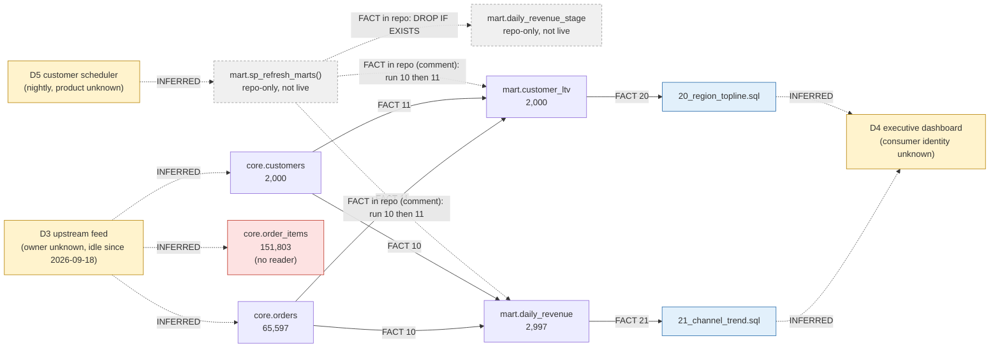

# Order analytics — live Redshift estate inventory

Plan step `estate-inventory` (phase Foundation), ticket UNT2-3, branch `migration-run-13`.
Census taken 2026-10-02 13:59–15:30 UTC.

| Item | Value |
|---|---|
| Source | Redshift Serverless `demo-wg`, database `demo`, schemas `core` and `mart` |
| Read path | Lakehouse Federation only: connection `redshift_demo` → foreign catalog `redshift_src`, SQL warehouse `565cd2fd713738c4` |
| Identity | OAuth M2M service principal `d9d1c4ec-29da-4ec7-9aa0-e932710d61e2` via `DATABRICKS_HOST` / `DATABRICKS_CLIENT_ID` / `DATABRICKS_CLIENT_SECRET` (names only; no PAT, no `aws redshift-data`, no boto3) |
| Tool | `databricks experimental aitools tools query --warehouse 565cd2fd713738c4` (official `databricks-core` skill) |
| Redshift-side user of the connection | `demoadmin` — FACT: every federated statement issued by this census appears in `sys_query_history` with `username = demoadmin` |
| Posture | Read-only. No legacy `sql/etl/*` executed, no write to `redshift_src`, no write to Redshift. The only Databricks-side writes were none. |
| Workspace contract | `.migration/allowed_targets.json` (catalog `migration_demo`, guard `block`), `.migration/03_recon_tolerances.json` (source concurrency 1, path = federation), `.migration/09_capabilities.json` `ready: true` |

## 1. Verdict for gate `g-inventory`

- Census size `N = 7` (5 live tables + 2 repo-only objects whose live state was checked). Arithmetic
  `7 = 3 (pipelines) + 2 (shared) + 2 (PROPOSED-unused) + 0 (confirmed exclusions)` — proven in §4,
  table count cross-checked against four independent catalog views.
- Every live-only object is classified: there are **no live-only objects**. The live estate is a strict
  subset of the repo. `mart.daily_revenue_stage` does **not** exist live; `mart.sp_refresh_marts` does
  **not** exist live. Both are repo-only and land in PROPOSED-unused (§5).
- `core.order_items` is live and in the repo DDL but has **no reader anywhere** (no ETL, no report, no
  query in the visible history) → PROPOSED-unused with a consumer question for the customer (§5).
- Marts are internally consistent with core to the cent (§9): a clean recon baseline.
- "`core` grows continuously" (ticket) is **not observed**: `core.orders` was 65,597 at 14:01, 15:21 and
  15:28 UTC; `max(loaded_at) = 2026-09-18 16:10:56 UTC`. Treat the feed as idle until the D3 owner says otherwise.
- Procedures, grants, masking/RLS and the last ~44 h of query history **were** reachable through
  federation; what was not is listed in §12 with a named supplier.

## 2. Live object census (`redshift_src` = `demo`)

| # | Object | Kind | Rows (15:21 UTC) | Owner | Dist / sort | Size MB | Created (UTC) | Source of count |
|---|---|---|---:|---|---|---:|---|---|
| 1 | `core.customers` | TABLE | 2,000 | `IAM:Devin-PartnerWorkshops-Demo` | `KEY(customer_id)` / `signup_date` | 2,750 | 2026-08-11 20:44:36 | `COUNT(*)` = `svv_table_info.tbl_rows` |
| 2 | `core.orders` | TABLE | 65,597 | `IAM:Devin-PartnerWorkshops-Demo` | `KEY(customer_id)` / `order_ts` | 1,420 | 2026-08-11 20:44:37 | `COUNT(*)` = `tbl_rows`; = ticket reference 65,597 |
| 3 | `core.order_items` | TABLE | 151,803 | `IAM:Devin-PartnerWorkshops-Demo` | `KEY(order_id)` / `order_id` | 2,052 | 2026-08-11 20:44:39 | `COUNT(*)` = `tbl_rows` |
| 4 | `mart.daily_revenue` | TABLE | 2,997 | `demoadmin` | `ALL` / `order_date` | 36 | 2026-09-24 18:23:03 | `COUNT(*)` = `tbl_rows`; = ticket reference 2,997 |
| 5 | `mart.customer_ltv` | TABLE | 2,000 | `demoadmin` | `KEY(customer_id)` / `customer_id` | 3,072 | 2026-09-24 18:23:04 | `COUNT(*)` = `tbl_rows` |

Other object kinds in `core` + `mart` (all FACT, through federation):

| Kind | Live count | Evidence |
|---|---:|---|
| Views | 0 | `information_schema.views`, `pg_catalog.pg_views` (both empty for `core`,`mart`) |
| Stored procedures | 0 | `svv_redshift_functions WHERE function_type='STORED PROCEDURE'` lists exactly 2 procedures on the whole workgroup, both in database `mig_redshift_src.public` (`sp_build_churn_flags`, `sp_upsert_inventory`); none in `demo`. `information_schema.routines` empty for `core`,`mart` |
| User functions | 0 | `svv_redshift_functions WHERE schema_name IN ('core','mart')` empty |
| Constraints | 0 | `information_schema.table_constraints` empty (no PK/FK declared; `IDENTITY` only) |
| Masking policies | 0 | `svv_masking_policy`, `svv_attached_masking_policy` empty |
| RLS policies | 0 | `svv_rls_policy`, `svv_rls_attached_policy` empty |
| Column grants | 0 | `svv_column_privileges` empty for `core`,`mart` |
| Schemas | 2 | `svv_redshift_schemas`: `demo.core`, `demo.mart`, both `local`, owner id 101 = `IAM:Devin-PartnerWorkshops-Demo` |

Table-count cross-check (completeness of the 5): `information_schema.tables` = 5, `pg_catalog.pg_tables` = 5,
`svv_table_info` = 5, `svv_all_tables WHERE database_name='demo'` = 5. **VERIFIED**.

### 2.1 Live columns (from `information_schema.columns`)

| Table | Columns (live type) |
|---|---|
| `core.customers` | `customer_id INTEGER IDENTITY`, `customer_code CHAR(12)`, `full_name VARCHAR(120)`, `email VARCHAR(160)`, `region CHAR(4)`, `signup_date DATE`, `is_active BOOLEAN`, `created_at TIMESTAMP DEFAULT GETDATE()` |
| `core.orders` | `order_id BIGINT IDENTITY`, `customer_id INTEGER`, `order_ts TIMESTAMP`, `order_status CHAR(10)`, `order_total NUMERIC(12,2)`, `sales_channel VARCHAR(20)`, `loaded_at TIMESTAMP DEFAULT GETDATE()` |
| `core.order_items` | `order_item_id BIGINT IDENTITY`, `order_id BIGINT`, `sku CHAR(16)`, `quantity SMALLINT`, `unit_price NUMERIC(10,2)`, `discount_pct NUMERIC(5,4)` |
| `mart.daily_revenue` | `order_date`, `region CHAR(4)`, `channel_group`, `order_count`, `gross_revenue`, `avg_order_value` (6; CTAS-derived types) |
| `mart.customer_ltv` | `customer_id`, `customer_code`, `region`, `first_order_ts`, `last_order_ts`, `lifetime_orders`, `lifetime_revenue`, `avg_order_value`, `active_days` (9; CTAS-derived types) |

Live column sets match `sql/ddl/02_core_tables.sql` and the CTAS column lists in `sql/etl/10`/`11` one-for-one (no drift in names or order).

### 2.2 Data profile relevant to conversion and recon (FACT)

| Fact | Value | Why it matters |
|---|---|---|
| `core.orders` time span | `order_ts` 2025-08-11 00:08:28 → 2026-09-18 16:01:55; `loaded_at` 2026-08-11 20:44:55 → 2026-09-18 16:10:56 | Last ingestion 2026-09-18; no load since |
| `core.orders` status mix | `CANCELLED` 10,190 · `DELIVERED` 30,284 · `PLACED` 14,986 · `SHIPPED` 10,137 (values are blank-padded `CHAR(10)`) | Repo filter `<> 'CANCELLED  '` relies on padding → `rtrim` rule in tolerances |
| `core.orders` channel mix | `app` 16,472 · `phone` 16,437 · `store` 16,374 · `web` 16,314 | `DECODE` → `ONLINE` (web, app) / `RETAIL` (phone, store) |
| `core.customers` regions | `EAST` 484 · `NRTH` 514 · `SOTH` 514 · `WEST` 488 (`CHAR(4)`) | `region` is a 4-char code, not a name |
| Referential state | 0 orphan `order_items`; items cover `order_id` 1..60,767; 4,830 orders (ids > 60,767) have no items | Items feed stopped before the orders feed; nothing reads items today |
| `mart.daily_revenue` | 375 distinct `order_date`, 2025-08-11 → 2026-09-18; Σ`order_count` 55,407; Σ`gross_revenue` 47,845,577.89 | — |
| `mart.customer_ltv` | 2,000 rows; Σ`lifetime_orders` 55,407; Σ`lifetime_revenue` 47,845,577.89 | — |
| Recompute of `10_build_daily_revenue` logic over live core (through federation, read-only) | 2,997 rows / 55,407 / 47,845,577.89 — identical for `as of today` and `as of 2026-09-24` | Marts equal a fresh rebuild; zero drift since 2026-09-24 |
| Recompute of `11_build_customer_ltv` logic | 2,000 / 55,407 / 47,845,577.89 | Same |
| Stats | `stats_off` 0 except `core.orders` 7; `unsorted` 75–99 % on core tables | Cosmetic for Delta; noted for completeness |

## 3. Diff: live estate vs repository

| Object | Repo definition | Live (`redshift_src`) | Verdict |
|---|---|---|---|
| schema `core` | `sql/ddl/01_schemas.sql` | present, owner `IAM:Devin-PartnerWorkshops-Demo` | MATCH |
| schema `mart` | `sql/ddl/01_schemas.sql` | present, owner `IAM:Devin-PartnerWorkshops-Demo` | MATCH |
| `core.customers` | `sql/ddl/02_core_tables.sql` (DISTKEY/SORTKEY/IDENTITY) | present, same columns, same dist/sort | MATCH |
| `core.orders` | `sql/ddl/02_core_tables.sql` | present, same columns, same dist/sort | MATCH |
| `core.order_items` | `sql/ddl/02_core_tables.sql` | present, same columns, same dist/sort | MATCH (no reader — §5) |
| `mart.daily_revenue` | `sql/etl/10_build_daily_revenue.sql` (DROP + CTAS, `DISTSTYLE ALL`, `SORTKEY(order_date)`) | present, `ALL` / `order_date`, content equals a recompute of the repo logic | MATCH |
| `mart.customer_ltv` | `sql/etl/11_build_customer_ltv.sql` (DROP + CTAS, `DISTKEY/SORTKEY(customer_id)`) | present, `KEY(customer_id)` / `customer_id`, content equals a recompute | MATCH |
| `mart.sp_refresh_marts()` | `sql/etl/12_sp_refresh_marts.sql` (plpgsql wrapper: RAISE INFO, `DROP TABLE IF EXISTS mart.daily_revenue_stage`, comment "scheduler runs 10 then 11") | **absent** — not in `svv_redshift_functions` (which does list procedures: 2 exist, both in `mig_redshift_src`), not in `information_schema.routines`, never called in `sys_procedure_call` | REPO-ONLY |
| `mart.daily_revenue_stage` | referenced only by `DROP TABLE IF EXISTS` in `12_sp_refresh_marts.sql`; no `CREATE` anywhere in the repo | **absent** from all four table catalogs; no query in history mentions it except this census | REPO-ONLY (phantom) |
| `sql/reports/20_region_topline.sql` | reads `mart.customer_ltv` | not a DB object; no live read of `mart.customer_ltv` in the visible history other than this census | consumer query (D4) |
| `sql/reports/21_channel_trend.sql` | reads `mart.daily_revenue` | not a DB object; no live read in the visible history other than this census | consumer query (D4) |
| Live-only objects | — | none | — |

Repo DDL/ETL is therefore confirmed as the source of truth for definitions; the only divergence is that
the repo contains two objects the live estate does not.

## 4. Coverage arithmetic

Census universe = every schema-level object that is live in `demo.core`/`demo.mart` **or** defined /
referenced in the seven repo files (schemas are containers, report files are consumers; neither is counted).

```
N = 5 live tables + 2 repo-only objects = 7

pipelines            = 3   P1 mart.daily_revenue · P2 mart.customer_ltv · P3 mart.sp_refresh_marts (orchestrator, repo-only)
shared               = 2   core.customers · core.orders            (read by both P1 and P2 — D2, wave 0)
PROPOSED-unused      = 2   core.order_items · mart.daily_revenue_stage
confirmed exclusions = 0   (no plan decision excludes anything)

3 + 2 + 2 + 0 = 7 = N   ✔
```

| Count | Status | Cross-check |
|---|---|---|
| Tables (5) | VERIFIED | four catalog views agree (§2) |
| Views (0) | VERIFIED | two catalog views agree |
| Procedures / functions (0 in scope) | VERIFIED | `svv_redshift_functions` enumerates procedures workgroup-wide (proved by the two it finds elsewhere); `information_schema.routines` agrees |
| Grants | VERIFIED (object level) | `svv_relation_privileges`, `svv_schema_privileges`, `svv_default_privileges`, `svv_database_privileges`; `information_schema.table_privileges` shows the `mart` subset (owner-scoped) |
| Role membership | UNVERIFIABLE | `svv_user_grants` empty, `svv_users`/`pg_user`/`pg_group` unreachable (§12 G3) |
| Query history | PARTIAL | `sys_query_history` covers 2026-09-30 21:06 → now only; `stl_query` unreachable (§12 G2) |
| Scheduler definitions | UNVERIFIABLE | not a Redshift catalog object (§12 G4) |
| Ingestion loader | UNVERIFIABLE | `sys_load_history`, `sys_copy_job` empty in window (§12 G5) |

## 5. PROPOSED-unused set

| Object | State | Why proposed unused | What would move it out | Disposition |
|---|---|---|---|---|
| `core.order_items` | live, 151,803 rows, in repo DDL | No ETL, report or procedure reads it; no query touched it in the visible history (every hit is this census); its feed stopped at `order_id` 60,767 while orders continued to 65,597 | Customer names a consumer (D4) or the D3 owner confirms it is part of the feed contract | Still migrates in wave 0 as data-only because the approved target state (`04_target_state.md`, CORE row) lists it; the PROPOSED flag is a consumer question, not a drop proposal |
| `mart.daily_revenue_stage` | **not live**; repo mentions it only in `DROP TABLE IF EXISTS` | Never created by any repo file, no live object, no history | Nothing — recommend the manager record it as a confirmed exclusion (`N` arithmetic then becomes 3+2+1+1) | Nothing to convert; the `DROP` line in `12_sp_refresh_marts.sql` is dead code for the Lakeflow Job conversion |

`mart.sp_refresh_marts` is also repo-only but is **not** unused: it is the D5 scheduler entry point the
ORCHESTRATION surface converts, so it is counted under pipelines (P3), with its live absence recorded.

## 6. Pipeline catalog

| Pipeline | Units (repo) | Objects owned | Reads | Writes | Consumer | Complexity | Lineage depth | Dialect risk | Run evidence |
|---|---|---|---|---|---|---|---|---|---|
| **P1 daily revenue** | `sql/etl/10_build_daily_revenue.sql` | `mart.daily_revenue` | `core.orders`, `core.customers` | full-refresh `DROP`+CTAS | `sql/reports/21_channel_trend.sql` (30-day channel trend) | low: 1 join, 3-key group, `DECODE`, `TRUNC(ts)`, `GETDATE`, `CHAR` compare, `NULLIF` | 2 (core → mart → report) | low-medium (`TRUNC`→`DATE`, `DECODE`→`CASE`, padded `CHAR` compare, `DISTSTYLE`/`SORTKEY` dropped) | last build 2026-09-24 18:23:03 UTC (table `create_time`); content = recompute |
| **P2 customer LTV** | `sql/etl/11_build_customer_ltv.sql` | `mart.customer_ltv` | `core.orders`, `core.customers` | full-refresh `DROP`+CTAS | `sql/reports/20_region_topline.sql` (executive regional topline) | low: 1 join, 9 aggregates, `DATEDIFF(day,…)` | 2 | low-medium (`DATEDIFF` argument order, `DISTKEY` dropped) | last build 2026-09-24 18:23:04 UTC; content = recompute |
| **P3 nightly refresh orchestrator** | `sql/etl/12_sp_refresh_marts.sql` | `mart.sp_refresh_marts()` (repo-only) | — | drops `mart.daily_revenue_stage` (phantom) | customer scheduler (D5) | trivial: logging + dead `DROP`; ordering 10 → 11 lives in a comment | 3 (wraps P1, P2) | plpgsql → Lakeflow Job with two SQL tasks; no procedure body to port | none: not deployed live, zero `CALL`s in history, no rebuild in 8 days |

Shared (D2, migrate once in wave 0 under P1 as first owner): `core.customers`, `core.orders`.
PROPOSED-unused but in wave-0 scope as data-only: `core.order_items`.

## 7. Lineage DAG



| Edge | Type | Evidence |
|---|---|---|
| feed → `core.customers` / `core.orders` / `core.order_items` | INFERRED | tables owned by `IAM:Devin-PartnerWorkshops-Demo`; `loaded_at`/`created_at` default `GETDATE()`; no `COPY` in `sys_load_history`/`sys_copy_job`; no INSERT in `demo` during the visible window → mechanism and owner unknown |
| `core.orders`, `core.customers` → `mart.daily_revenue` | FACT | `sql/etl/10`; live recompute identical (§2.2) |
| `core.orders`, `core.customers` → `mart.customer_ltv` | FACT | `sql/etl/11`; live recompute identical |
| `mart.sp_refresh_marts` → ordering 10 → 11 | FACT (repo) / absent live | `sql/etl/12` comment; procedure not deployed |
| `mart.sp_refresh_marts` → `mart.daily_revenue_stage` | FACT (repo) / dead | `DROP TABLE IF EXISTS`; neither object exists live |
| scheduler → `mart.sp_refresh_marts` | INFERRED | README + `12_sp_refresh_marts.sql` say "nightly from the customer scheduler"; zero `CALL`s in `sys_procedure_call`; last rebuild 8 days ago |
| `mart.daily_revenue` → `21_channel_trend.sql`, `mart.customer_ltv` → `20_region_topline.sql` | FACT | repo report files |
| reports → executive dashboard | INFERRED | `04_target_state.md` CONSUMER row; no dashboard read in the visible history; `PUBLIC SELECT` on `mart.*` is consistent with an anonymous/any-user BI reader |
| `core.order_items` → anything | none | no reader found in repo or history |

## 8. Shared-object ownership map

| Object | Owner pipeline (migrates it) | Also read by | Wave | Note |
|---|---|---|---|---|
| `core.customers` | P1 (first owner) | P2 | 0 | D2 `wave0`; single-shot CTAS from `redshift_src` per `04_target_state.md` |
| `core.orders` | P1 | P2 | 0 | D2 `wave0`; the only table whose growth matters for drift (idle since 2026-09-18) |
| `core.order_items` | P1 (data-only, by target state) | — | 0 | PROPOSED-unused; migrate, do not model downstream |
| `mart.*` tables | P1 / P2 respectively | reports | 1 / 2 | rebuilt on Databricks from `migration_demo.core`, never copied |

## 9. Governance rows (dependency table) — credentials never enter this file

| # | Securable | Grantee | Privilege | Grantee type | Role / service account | Masking / RLS | Cited query |
|---|---|---|---|---|---|---|---|
| G-01 | `mart.daily_revenue` | `public` | SELECT | public | — | none | `SELECT * FROM redshift_src.pg_catalog.svv_relation_privileges WHERE namespace_name IN ('core','mart')` |
| G-02 | `mart.customer_ltv` | `public` | SELECT | public | — | none | same |
| G-03 | `mart.daily_revenue`, `mart.customer_ltv` | `IAM:Devin-PartnerWorkshops-Demo` (id 101) | INSERT, SELECT, UPDATE, DELETE, RULE, REFERENCES, TRIGGER, DROP, TRUNCATE, ALTER | user (IAM) | schema owner of `core`,`mart`; table owner of `core.*` | none | same |
| G-04 | `mart.daily_revenue`, `mart.customer_ltv` | `IAM:devin-redshift-demo` (id 102) | INSERT, SELECT, UPDATE, DELETE, RULE, REFERENCES, TRIGGER, DROP, TRUNCATE, ALTER | user (IAM) | the "read-only" legacy IAM user named in `04_target_state.md` | none | same |
| G-05 | `core.customers`, `core.orders`, `core.order_items` | `IAM:devin-redshift-demo` (102) | INSERT, SELECT, UPDATE, DELETE, RULE, REFERENCES, TRIGGER, DROP, TRUNCATE, ALTER | user (IAM) | as above | none | same |
| G-06 | `core.*` | `IAM:Devin-PartnerWorkshops-Demo` (101) | owner (implicit ALL) | user (IAM) | owner | none | `svv_table_info`, `pg_tables.tableowner` |
| G-07 | `mart.*` | `demoadmin` (id 100) | owner (implicit ALL); superuser | user | Redshift admin; **also the Redshift-side user of federation connection `redshift_demo`** | none | `pg_tables.tableowner`; `sys_query_history.username` for this census |
| G-08 | schema `core`, schema `mart` | `IAM:devin-redshift-demo` | USAGE | user (IAM) | — | — | `svv_schema_privileges`; `svv_redshift_schemas.schema_acl` (`UCDA` for 101, `U` for 102) |
| G-09 | schema `core`, schema `mart` | `IAM:Devin-PartnerWorkshops-Demo` | USAGE, CREATE, DROP, ALTER (owner) | user (IAM) | owner (id 101) | — | `svv_redshift_schemas` |
| G-10 | default privileges in `core`, `mart` for relations created by `demoadmin` | 101 and 102 | ALL ten relation privileges | user (IAM) | — | — | `svv_default_privileges` |
| G-11 | database `demo` | `public` | TEMP | public | — | — | `svv_database_privileges` |
| G-12 | roles | `IAM:Partner-DEs`, `sys:operator`, `sys:monitor`, `sys:dba`, `sys:secadmin`, `sys:superuser` | — | role | membership of `IAM:Partner-DEs` **unknown** (§12 G3) | — | `svv_roles`, `svv_role_grants` (`sys:dba` → `sys:operator` only), `svv_user_grants` (empty) |
| G-13 | identity providers | none | — | — | IAM-federated users (`IAM:` prefix) authenticate through AWS IAM, not a native IdP | — | `svv_identity_providers` (empty) |

Findings for the manager (facts, no action taken):

- **F-1** `IAM:devin-redshift-demo` is described as a read-only user in `04_target_state.md` and the
  ticket, but holds full DML + DROP/TRUNCATE/ALTER on all five tables (G-04, G-05) and inherits the same
  by default ACL (G-10). It cannot CREATE in `mart` (no `C` in the schema ACL), which is exactly the
  "can DROP but not CREATE" hazard already recorded. No migration session uses this identity; the
  guard keeps it that way.
- **F-2** The federation connection reaches Redshift as `demoadmin` (G-07), i.e. owner/superuser. UC's
  foreign catalog is read-only, so writes are impossible through `redshift_src`, but the Redshift-side
  blast radius of that connection credential is the whole workgroup. Worth a D8 note for the customer.
- **F-3** Both mart builds are `DROP TABLE` + `CREATE TABLE … AS`; on Redshift that discards the
  `PUBLIC SELECT` grant unless something re-grants it afterwards, and no repo file does. Either the
  nightly procedure re-grants (not in the repo), or the grant is re-applied by hand after each rebuild.
  The converted job must keep grants stable (UC `CREATE OR REPLACE TABLE` preserves them) — item for
  `pipeline-analysis`.

## 10. Dependency crossings (D3–D9 register)

Only the four crossings named in the ticket exist in this estate (plus D2 shared objects, §8). No D6
(no non-migrated writer of a shared table), no D7 (no file/queue hand-off), no D9 (no ML consumer).

### D3 — upstream ingestion feed into `core.*`

| Field | Value |
|---|---|
| Source | An external loader writing `core.customers`, `core.orders`, `core.order_items` in Redshift `demo` |
| Target | `migration_demo.core.*` (Delta), per `04_target_state.md` CORE row |
| Owner | **UNKNOWN** — the tables are owned by `IAM:Devin-PartnerWorkshops-Demo`; whoever operates that IAM principal owns the feed |
| Mechanism | **UNKNOWN** — not `COPY` (no `sys_load_history`/`sys_copy_job` rows in window); columns default `GETDATE()` so most likely row INSERTs by the loader (INFERRED) |
| Cadence / last run | last `loaded_at` 2026-09-18 16:10:56 UTC; no INSERT into `demo` in the 2026-09-30 → now history. Ticket's "grows continuously" **not observed** |
| Lead time | unknown |
| Evidence | `max(loaded_at)`, `svv_table_info.create_time`, `sys_load_history`, `sys_copy_job`, `sys_query_history` by `database_name`/`query_type` |
| Options | `federate` (default — keep Redshift as writer, read through `redshift_src`, resync by CTAS before each recon) / `connect` / `loader` |
| Routing point | the loader's JDBC/Data-API target at cutover |
| Cutover / decommission condition | loader re-pointed to `migration_demo.core` **or** feed confirmed retired; until then every wave's recon must re-baseline `migration_demo.core` from `redshift_src` |
| Open blockers | feed owner and mechanism (→ §12 G5) |

### D4 — executive dashboard reading the marts

| Field | Value |
|---|---|
| Source | `sql/reports/20_region_topline.sql` (reads `mart.customer_ltv`), `sql/reports/21_channel_trend.sql` (reads `mart.daily_revenue`) |
| Target | the same two queries converted to Databricks SQL over `migration_demo.mart.*` (`04_target_state.md` CONSUMER row) |
| Owner / tool / credential | **UNKNOWN** — no read of either mart in the visible history except this census; `PUBLIC SELECT` on `mart.*` means the reader can be any Redshift user |
| Lead time | unknown |
| Evidence | repo report files; `svv_relation_privileges` (`public` SELECT); `sys_query_history` (no third-party reads 2026-09-30 → now) |
| Options | `repoint` (default) / `dual` / `rebuild` |
| Routing point | the dashboard's connection string / data source |
| Cutover condition | report parity (`sql/reports/20,21` vs converted) green in `dbx-recon`, then re-point |
| Open blockers | dashboard owner, tool and connecting identity (→ §12 G6) |

### D5 — customer scheduler calling the nightly refresh

| Field | Value |
|---|---|
| Source | "customer scheduler" calling `mart.sp_refresh_marts()` nightly, which runs `10` then `11` (README, `12_sp_refresh_marts.sql`) |
| Live state | the procedure **is not deployed** in `demo`; zero `CALL`s in `sys_procedure_call`; marts last rebuilt 2026-09-24 18:23 UTC — 8 days without a nightly run → scheduler is idle, points elsewhere, or runs the two scripts directly (INFERRED) |
| Target | Lakeflow Job in a DAB (`targets: migration`), two SQL tasks on `565cd2fd713738c4` in order 10 → 11, schedule PAUSED until cutover (`04_target_state.md` ORCHESTRATION row) |
| Owner / product | **UNKNOWN** (cron, Airflow, EventBridge scheduled query, …) |
| Lead time | unknown |
| Evidence | `svv_redshift_functions`, `information_schema.routines`, `sys_procedure_call`, `svv_table_info.create_time` |
| Options | `jobs` (default) / `retain` / `hybrid` |
| Routing point | the scheduler's job definition (disable legacy, un-pause Lakeflow Job) |
| Cutover condition | one green recon cycle from the Lakeflow Job before the legacy schedule is disabled |
| Open blockers | scheduler owner and definition (→ §12 G4) |

### D8 — grants on `mart` (recon path relies on `GRANT SELECT … TO PUBLIC`)

| Field | Value |
|---|---|
| Legacy contract | `SELECT` on `mart.daily_revenue` and `mart.customer_ltv` granted to `PUBLIC` (G-01, G-02, FACT). No masking, no RLS, no column grants, no retention policy (§2) |
| Who depends on it | any non-owner reader of `mart.*`: the dashboard (D4) and — per the ticket — the recon path. Note: today's federation connection runs as `demoadmin` (owner), so recon through `redshift_src` would read `mart.*` even without the PUBLIC grant; the dependency is real for every other identity (e.g. `IAM:devin-redshift-demo`, dashboard users) |
| Fragility | full-refresh `DROP`+CTAS drops the grant each run (F-3); the re-grant step is not in the repo |
| Target | reproduce in UC **before** any consumer re-points: `GRANT SELECT ON SCHEMA migration_demo.mart TO <consumer group>` (the UC analogue of PUBLIC is a decision — `account users` or a named dashboard group); grants applied once in wave 0 and preserved by `CREATE OR REPLACE TABLE` |
| Owner | migration (UC side); customer security owner for who the consumer group is |
| Evidence | `svv_relation_privileges`, `svv_default_privileges`, `svv_masking_policy`, `svv_rls_policy`, `svv_column_privileges` |
| Options | `uc` |
| Routing point | UC grants on `migration_demo.mart` at wave 0; consumer re-point at cutover |
| Cutover condition | UC grant present and verified (`SHOW GRANTS ON SCHEMA migration_demo.mart`) before D4 re-point |
| Open blockers | choice of UC principal standing in for `PUBLIC` (plan decision); who re-grants on Redshift after each legacy rebuild (G8 in §12) |

### D10 — nothing new

No new access dependency arises from this census: every read the inventory needed went through the
already-granted federation path. The metadata the customer must supply (§12) is information, not access.

## 11. Run evidence and query history

`redshift_src.pg_catalog.sys_query_history` is readable through federation. Window at census time:
8,888 statements, 2026-09-30 21:06:26 → 2026-10-02 15:28:37 UTC (≈ 42 h). Breakdown by database:

| Database | Statements | Composition |
|---|---:|---|
| `demo` (the estate) | 369 | 364 SELECT + 4 OTHER + 1 UTILITY, **all** by `demoadmin`: JDBC driver metadata calls, the 2026-10-02 14:01 UTC probe counts quoted in the ticket, and this census. **No INSERT/COPY/CTAS/DDL, no `CALL`, no report query** |
| `dev` | 7 | `demoadmin` bootstrapping on 2026-09-30 21:28 (`CREATE DATABASE "mig_redshift_src"`) |
| `mig_redshift_src` | 8,512 | 7,915 INSERT, 198 DDL, 66 CTAS, 292 SELECT, 29 UTILITY, 3 DELETE, 9 OTHER; procedures `sp_build_churn_flags()` and `sp_upsert_inventory(date)` called repeatedly 2026-09-30 21:37–21:55 |

Conclusions (FACT within the window): no ingestion, no mart rebuild, no scheduler call and no dashboard read
hit the estate in the last 42 h; the only activity against `demo` was the migration's own metadata reads.
Last ingestion (2026-09-18) and last rebuild (2026-09-24) predate the window and are known only from table
metadata.

## 12. Evidence gaps

Each gap names what is missing, what was tried through `redshift_src` (never another client or identity),
the impact, and who can supply it. The suppliers are the natural owners of each artifact — inferred roles,
not confirmed names.

| Gap | Missing | Tried through federation | Impact | Who can supply |
|---|---|---|---|---|
| G1 | Procedure bodies / `pg_proc_info` | `redshift_src.pg_catalog.pg_proc`, `pg_proc_info` → `TABLE_OR_VIEW_NOT_FOUND`; `svl_stored_proc_call` → `FAILED_JDBC` | Low: `svv_redshift_functions` proves no procedure exists in `demo`, so there is no body to fetch; the repo wrapper is the only definition | Redshift admin (`demoadmin`) via `SHOW PROCEDURE`, if the customer claims a deployed version |
| G2 | Query history older than 2026-09-30 21:06 UTC (covering the 2026-09-24 rebuild and the 2026-09-18 load), and `stl_query`/`svl_*` detail | `sys_query_history` returns only the ≈42 h window; `stl_query` → `FAILED_JDBC.UNCLASSIFIED` | Medium: cadence of ingestion, rebuild and dashboard reads cannot be established; D3/D4/D5 edges stay INFERRED | Customer platform team: Redshift audit logs (CloudWatch / S3 user-activity log) or a `sys_query_history` export taken by the admin |
| G3 | Users and role memberships (`svv_users`, `pg_user`, `pg_group`; members of `IAM:Partner-DEs`; who effectively is `PUBLIC`) | `svv_users`/`pg_user`/`pg_group` → not found / `FAILED_JDBC`; `svv_user_grants` returned 0 rows | Medium for D8: the consumer population behind `PUBLIC SELECT` is unknown | Redshift admin or AWS IAM owner (IAM-federated users) |
| G4 | Scheduler definition for the nightly refresh (product, schedule, run-as, current target) | not a Redshift catalog object; no `CALL` in history | High for D5: the Lakeflow Job replaces something whose owner and current state are unknown | Scheduler / platform owner at the customer |
| G5 | Ingestion loader for `core.*` (mechanism, identity, schedule) | `sys_load_history`, `sys_copy_job` empty; no INSERT in window | High for D3: coexistence posture and resync cadence depend on it | Owner of IAM principal `Devin-PartnerWorkshops-Demo` / data-platform team |
| G6 | Dashboard consumer (tool, identity, connection) | no third-party read of `mart.*` in window | Medium for D4 re-point | BI / analytics owner |
| G7 | Column encodings and `IDENTITY(seed, step)` text | `pg_table_def`/`SHOW TABLE` not exposed through federation; `information_schema.columns` shows `IDENTITY` but not seed/step | Low: Delta drops encodings; seeds matter only if identity continuity is required after cutover | Redshift admin (`SHOW TABLE core.orders`) |
| G8 | Who re-grants `SELECT … TO PUBLIC` after each `DROP`+CTAS rebuild | not in `sql/etl/*`; no DDL/GRANT in window | Medium for D8 (F-3) | Scheduler owner (G4) or Redshift admin |

Also noted, outside the `redshift_src` scope and therefore **not** counted in N: the same workgroup hosts
databases `dev` and `mig_redshift_src` (created 2026-09-30 21:28 UTC by `demoadmin`; 10 `core` and 19 `mart`
tables, two procedures, 7,915 INSERTs in the window). It looks like a prior migration's staging database,
not customer estate. Manager to confirm it is out of scope; nothing in this plan reads or writes it.

## 13. Parallelism profile

| Pipeline | Width (independent units) | Serial floor | Depends on | Source-read concurrency (D10 / `03_recon_tolerances.json` cap = 1) |
|---|---:|---|---|---|
| wave 0 — shared core (`customers`, `orders`, `order_items`) | 3 CTAS, each a single federated scan | 3 sequential scans (cap 1): 2,000 + 65,597 + 151,803 rows, small-and-static class | — | 1 |
| P1 daily revenue | 1 (one CTAS unit + one report) | 1 | wave 0 | 0 after wave 0 (rebuilds read `migration_demo.core`); recon reads `redshift_src.mart.daily_revenue` → 1 |
| P2 customer LTV | 1 | 1 | wave 0 | as P1 |
| P3 orchestrator | 1 (job definition) | 1 | P1, P2 merged | 0 |

Estate-level: critical path = wave 0 → (P1 ∥ P2) → P3; on-target width 2 for the mart waves;
against the source everything serialises to 1 concurrent federated query (recon included). Lineage
depth 2 (3 with the orchestrator). Nothing here justifies more than one worker per wave.

## 14. Recommendation to the manager

1. Accept `N = 7 = 3 + 2 + 2 + 0`; record `mart.daily_revenue_stage` as a confirmed exclusion by plan
   decision (arithmetic becomes `3 + 2 + 1 + 1`).
2. Keep `core.order_items` in wave 0 as data-only and put the consumer question to the customer; do not
   model it downstream until someone claims it.
3. Carry G4 (scheduler) and G5 (loader) as the two blockers that gate D5 and D3; G2 (audit log export)
   would close both cheaply. G3 and the PUBLIC-stand-in choice gate the D8 UC grant.
4. Re-baseline assumption: the feed is idle. If drift is injected later, the single-shot CTAS of wave 0
   needs a resync step before each recon (already allowed by `04_target_state.md`).
5. `pipeline-analysis` inputs: padded `CHAR` compares (`order_status`, `region`), `DECODE` → `CASE`,
   `TRUNC(ts)` → `DATE`, `DATEDIFF` order, `DISTSTYLE/SORTKEY/IDENTITY` removal, and grant-preserving
   `CREATE OR REPLACE TABLE` instead of `DROP`+`CREATE`.

## Appendix A — queries behind this inventory (all `SELECT`, all against `redshift_src`)

```
-- objects
SELECT table_schema, table_name, table_type FROM redshift_src.information_schema.tables WHERE table_schema IN ('core','mart')
SELECT schemaname, tablename, tableowner FROM redshift_src.pg_catalog.pg_tables WHERE schemaname IN ('core','mart')
SELECT * FROM redshift_src.pg_catalog.svv_table_info WHERE schema IN ('core','mart')
SELECT database_name, schema_name, table_name, table_type FROM redshift_src.pg_catalog.svv_all_tables WHERE schema_name IN ('core','mart')
SELECT * FROM redshift_src.information_schema.views WHERE table_schema IN ('core','mart')
SELECT schemaname, viewname FROM redshift_src.pg_catalog.pg_views WHERE schemaname IN ('core','mart')
SELECT * FROM redshift_src.information_schema.routines WHERE routine_schema IN ('core','mart')
SELECT * FROM redshift_src.pg_catalog.svv_redshift_functions WHERE function_type = 'STORED PROCEDURE'
SELECT * FROM redshift_src.pg_catalog.svv_redshift_schemas WHERE schema_name IN ('core','mart')
SELECT * FROM redshift_src.information_schema.columns WHERE table_schema IN ('core','mart') ORDER BY table_name, ordinal_position
SELECT table_name, constraint_type FROM redshift_src.information_schema.table_constraints WHERE table_schema IN ('core','mart')
-- counts and profile
SELECT COUNT(*) FROM redshift_src.core.customers / core.orders / core.order_items / mart.daily_revenue / mart.customer_ltv
SELECT min(order_ts), max(order_ts), max(loaded_at), max(order_id), count(DISTINCT customer_id) FROM redshift_src.core.orders
SELECT rtrim(order_status), count(*) FROM redshift_src.core.orders GROUP BY 1
SELECT sales_channel, count(*) FROM redshift_src.core.orders GROUP BY 1
SELECT rtrim(region), count(*) FROM redshift_src.core.customers GROUP BY 1
SELECT count(*), count(DISTINCT i.order_id), sum(CASE WHEN o.order_id IS NULL THEN 1 ELSE 0 END) FROM redshift_src.core.order_items i LEFT JOIN redshift_src.core.orders o ON o.order_id = i.order_id
SELECT min(order_date), max(order_date), count(*), sum(order_count), sum(gross_revenue) FROM redshift_src.mart.daily_revenue
SELECT count(*), sum(lifetime_orders), sum(lifetime_revenue) FROM redshift_src.mart.customer_ltv
-- read-only recompute of the repo mart logic (Databricks SQL dialect, no write)
SELECT count(*), sum(order_count), sum(gross_revenue) FROM (SELECT date(o.order_ts), c.region, CASE o.sales_channel WHEN 'web' THEN 'ONLINE' WHEN 'app' THEN 'ONLINE' ELSE 'RETAIL' END, count(DISTINCT o.order_id) order_count, sum(o.order_total) gross_revenue FROM redshift_src.core.orders o JOIN redshift_src.core.customers c ON c.customer_id = o.customer_id WHERE rtrim(o.order_status) <> 'CANCELLED' AND o.order_ts < current_date() GROUP BY 1,2,3)
SELECT count(*), sum(lifetime_orders), sum(lifetime_revenue) FROM (SELECT c.customer_id, count(o.order_id) lifetime_orders, sum(o.order_total) lifetime_revenue FROM redshift_src.core.customers c JOIN redshift_src.core.orders o ON o.customer_id = c.customer_id WHERE rtrim(o.order_status) <> 'CANCELLED' GROUP BY 1)
-- governance
SELECT * FROM redshift_src.pg_catalog.svv_relation_privileges WHERE namespace_name IN ('core','mart')
SELECT * FROM redshift_src.pg_catalog.svv_schema_privileges
SELECT * FROM redshift_src.pg_catalog.svv_default_privileges
SELECT * FROM redshift_src.pg_catalog.svv_database_privileges
SELECT * FROM redshift_src.pg_catalog.svv_column_privileges WHERE namespace_name IN ('core','mart')
SELECT * FROM redshift_src.information_schema.table_privileges WHERE table_schema IN ('core','mart')
SELECT * FROM redshift_src.pg_catalog.svv_roles / svv_role_grants / svv_user_grants / svv_identity_providers
SELECT * FROM redshift_src.pg_catalog.svv_masking_policy / svv_attached_masking_policy / svv_rls_policy / svv_rls_attached_policy
-- run evidence
SELECT count(*), min(start_time), max(start_time) FROM redshift_src.pg_catalog.sys_query_history
SELECT database_name, query_type, count(*) FROM redshift_src.pg_catalog.sys_query_history GROUP BY 1,2
SELECT start_time, rtrim(username), query_type, status, SUBSTRING(query_text,1,300) FROM redshift_src.pg_catalog.sys_query_history WHERE database_name = 'demo' ORDER BY start_time
SELECT * FROM redshift_src.pg_catalog.sys_procedure_call
SELECT * FROM redshift_src.pg_catalog.sys_load_history / sys_copy_job
-- failed (recorded as gaps): pg_proc, pg_proc_info, pg_class, pg_namespace, pg_user, pg_group, svv_users, stl_query, svl_stored_proc_call
```
